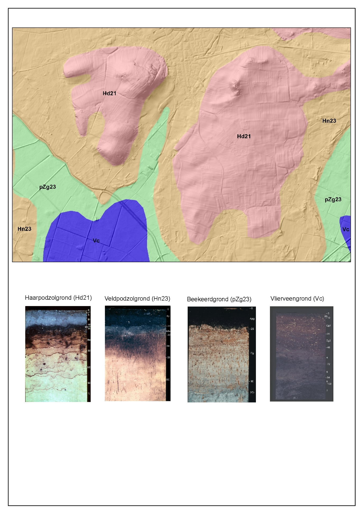

Toelichting
===========

De Bodemkaart is één van de registratieobjecten in de BRO, en wordt aangeduid
als een ‘model’. Voor de bodemkaart betekent dit dat de kaart zelf het ‘model’
is, dat tot stand gekomen is via de bodemkundige kartering. De kaart is een
resultaat van de interpretatie van data die in het veld zijn ingewonnen door
experts, de ‘veldbodemkundigen’. Dit is Informatie die ook in de BRO is
opgenomen, met name in de registratieobjecten bodemkundig boormonsteronderzoek
(BHR-p) en bodemkundig wandonderzoek (SFR-p), en grondwaterdynamiek zijn
hiervoor van belang. In deze objecten wordt profielopbouw met fysische en
chemische analyses geregistreerd.

Bodem en bodemkartering
-----------------------

De bodem is het buitenste deel van de aarde. Het materiaal waaruit de bodem
bestaat (het moedermateriaal of uitgangsmateriaal) is in ons land grotendeels
van elders aangevoerd, o.a. door de wind (löss, dekzand, stuifzand, duinzand),
de rivieren (rivierklei en –zand), de zee (zeeklei en –zand) en door het landijs
(smeltwaterafzettingen, keileem), soms is het ter plaatse ontstaan (veen).

Figuur 3 Vier bodemeenheden in hun landschappelijk verband. De eenheden op de
rug, op de helling en in het dal zijn verschillend. Elke eenheid (Hd21, Hn23,
pZg23 en Vc) wordt op de bodemkaart onderscheiden met een eigen code en kleur.
Onder het diagram een schematische voorstelling van de bodemprofielen van de
vier eenheden.

Door veranderingen in de sedimentatie vertoont het moedermateriaal vaak een
zekere gelaagdheid. Onder invloed van uitwendige omstandigheden treedt
bodemvorming op, waarbij veranderingen in het moedermateriaal ontstaan door
omzetting, uitspoeling en ophoping van minerale en organische stoffen . Elke
grond heeft dus als gevolg van de afzetting en van de bodemvorming een
opeenvolging van min of meer horizontale lagen, die verschillen in samenstelling
en eigenschappen. Deze lagen heten horizonten. Samenstelling, dikte en
opeenvolging van horizonten –het bodemprofiel- verschillen per grond. Gronden
met een ongeveer gelijk bodemprofiel beschouwt men als een eenheid
[[Simonson1968](https://broprogramma.github.io/SGM/#bib-simonson1968)]. Bij de
bodemkartering stelt men door boringen de bodemeenheden vast en bepaalt op basis
van overeenkomsten en verschillen tussen (groepen van) bodemprofielen de grenzen
van die eenheden. Verschillen in bodemgesteldheid en landschap gaan vaak samen,
omdat beide zijn ontstaan onder invloed van dezelfde uitwendige omstandigheden
([figuur 3](https://broprogramma.github.io/SGM/#bodemeenheden)). Dit is bij de
bodemkartering van groot belang, omdat het daardoor mogelijk is met betrekkelijk
weinig boringen de grenzen tussen de verschillende gronden op te sporen en in
kaart te brengen
[[Schelling-etal1975](https://broprogramma.github.io/SGM/#bib-schelling-etal1975)].

Gebruikersperspectief Bodemkaart
--------------------------------

De bodemkundige informatie op de Bodemkaart van Nederland 1: 50 000, die de
basis vormt voor het bodemkundig model in de Basisregistratie Ondergrond, heeft
betrekking op de aard en samenstelling van de bovengrond (grondsoort) met een
verdere onderverdeling naar bodemvorming, veensoort, afwijkende lagen in het
profiel, aanwezigheid van kalk en verstoringen door vergraving en egalisatie. De
kaart geeft bodemkundige informatie over de stedelijke gebieden op het moment
van de kartering. De bodemkaart is bedoeld voor nationale, regionale en lokale
studies op het gebied van hydrologie, bodemgeschiktheid, bodemkwetsbaarheid,
natuurontwikkeling, landschapsplanning en ruimtelijke planvorming.

Omdat informatie in het stedelijk gebied ontbreekt is de bodemkaart niet
geschikt voor het oplossen van stedelijke vraagstukken. Op locaties waar na de
kartering stedelijk gebied is ontstaan kan de bodemopbouw op die locatie
gewijzigd zijn. De beoordeling of het geleverde informatieniveau nog bruikbaar
is voor de specifieke vraagstelling is ter beoordeling aan de gebruiker. 

Het bodemkundig model is geschikt voor het afleiden van thematische kaarten.
Deze thematische kaarten vallen echter niet binnen de verantwoordelijkheid van
de Basisregistratie Ondergrond. In het gebruik voor nationale, regionale en
lokale toepassingen geldt dat de informatiebehoefte per oppervlakte-eenheid
toeneemt naarmate het probleem grootschaliger (‘lokaler’) wordt. De opnameschaal
van de data is 1:50.000 en geeft op dat schaalniveau het bijbehorende detail (1
cm2 op de kaart = 25 ha in het terrein). De beoordeling of het geleverde
informatieniveau overeenkomt met de informatiebehoefte voor de specifieke
vraagstelling is ter beoordeling aan de gebruiker. 

Domeinmodel Bodemkaart
----------------------

In het model is het deel dat gerelateerd is aan het registratieobject
Bodemkundig boormonsteronderzoek in de catalogus nu niet meegenomen. In dit
model volgen we de internationale standaard van INSPIRE[^1] zoals beschreven in
de ‘technical guideline’, omdat dat aansluit op het model ‘bodemkaart’ zoals
deze in Nederland wordt gebruikt. Pas als de samenhang op basis van het
Metamodel voor informatiemodellen, MIM[^2] (KKG metamodel) verder duidelijk is geworden kunnen we die relaties leggen en het
model daarop laten aansluiten.

[^1]: [INSPIRE Data Specification Theme SOIL, oktober 2018](https://inspire.ec.europa.eu/Themes/127/2892)

[^2]: [Metamodel voor Informatiemodellen, juni 2017](https://docs.geostandaarden.nl/mim/def-st-mim10-20170614/doc.pdf)

### Versiebeheer

De beheerder van een model maakt zijn waardenlijsten (codelijsten en/of
referentielijsten) bekend op een algemeen bekend formaat (PDF en als
downloadable bestand) en maakt deze toegankelijk via
www.basisregistratieondergrond.nl. De waardenlijsten worden meegeleverd bij de
modellevering.

Als er wijzigingen zijn in een waardelijst, wordt er uiterlijk twee maanden vóór
inwerkingtreding een notificatie op die website gezet, zodat gebruikers nog tijd
hebben om hun eigen omgeving op de wijzigingen aan te passen.

### De bodemkaart als bodemkundig model

De Bodemkaart van Nederland, schaal 1 : 50 000 vormt de basis voor het
bodemkundig model in de Basisregistratie Ondergrond. De kaart geeft voor het
landelijk gebied door middel van kaartvlakken informatie over de bodemopbouw en
bodemkenmerken tot een diepte van ca. 1,2 m-mv.
[[Steur-Heijink1991](https://broprogramma.github.io/SGM/#bib-steur-heijink1991)].
Elk kaartvlak of object bevat een code voor de bodemeenheid. De bodemkaart is
een 2-dimensionaal model dat de bodem als profiel tot 1,2 m –mv beschrijft,
waarmee het impliciet voor een deel 3D eigenschappen meekrijgt.

### Indeling bodemeenheden

Een bodemeenheid verstrekt informatie over belangrijke kenmerken van het
bodemprofiel tot een diepte van ca. 1,2 m-mv. De hoofdindeling van de
bodemeenheden is in hoofdlijnen een indeling naar moedermateriaal (grondsoort en
afzettingswijze) en bodemvorming. De verdere onderverdeling in hoofdklassen
sluit nauw aan bij die van het Systeem van Bodemclassificatie voor Nederland
[[Bakker-Schelling1989](https://broprogramma.github.io/SGM/#bib-bakker-schelling1989)]
tot en met het niveau van de subgroep. Dit niveau is in de legenda naamgevend.
De hoofdklassen worden op de bodemkaart gecodeerd met één of twee hoofdletters.
De volgende hoofdklassen worden onderscheiden:

-   Veengronden (code V);

-   Moerige gronden (code W);

-   Podzolgronden (codes Y en H);

-   Brikgronden (code B);

-   Dikke eerdgronden (codes EZ, EL en EK);

-   Kalkloze zandgronden (code Z);

-   Kalkhoudende zandgronden (code Z…A);

-   Kalkhoudende bijzondere lutumarme gronden (code S…A);

-   Niet-gerijpte minerale gronden (codes MO en RO);

-   Zeekleigronden (code M);

-   Rivierkleigronden (code R);

-   Oude rivierkleigronden (code KR);

-   Oude kleigronden (codes KX en KT);

-   Leemgronden (code L);

-   Oude gronden in Zuid-Limburg (codes MA, MK, MZ, FG, FK, KM, KK, KS).

De gronden worden in de legenda verder onderverdeeld naar o.a. aard en textuur
van de bovengrond, de gelaagdheid in het bodemprofiel, veensoort bij
veengronden, voorkomen van hydromorfe kenmerken en de aanwezigheid van kalk in
het profiel. Deze onderverdeling wordt in de code aangegeven met letters en
cijfers (bijvoorbeeld Hn21: veldpodzolgronden in leemarm en zwak lemig fijn
zand, of Zn23: vlakvaaggronden in lemig fijn zand). Met lettertoevoegingen aan
het begin en aan het eind van de code worden specifieke kenmerken van de
bovengrond en ondergrond aangeduid (bijvoorbeeld kHn21: veldpodzolgronden met
een kleidek (k…) of Hn21x: veldpodzolgronden met keileem in de ondergrond,
beginnend tussen 40 en 120 cm (…x).

#### Afgeleide profielen

De Bodemkaart van Nederland, schaal 1 : 50.000, onderscheidt meer dan 1700
unieke eenheden, verdeeld over iets meer dan 52.000 verschillende kaartvlakken.
Alterra-rapport 654 (De Vries, 1999) bevat documentatie over deze landelijke
bodemeenheden. Voor alle bodemeenheden met een landelijke oppervlakte van
tenminste 2000 ha geven afgeleide profielen informatie over belangrijke
kenmerken. Afgeleide profielen (ook wel standaardprofielen of profielschetsen
genoemd) zijn representatieve bodemprofielen voor de eenheden op de bodemkaart.
In totaal zijn er 315 verschillende bodemeenheden beschreven, gezamenlijk
beslaan deze eenheden ca. 83 % van de Nederlandse oppervlakte. De eenheden van
de bodemkaart met een gering oppervlakte (\< 2000 ha) zijn geassocieerd met
aanverwante beschreven eenheden. Op deze manier is de fysischchemische
karakterisering voor alle eenheden van de Bodemkaart van Nederland, schaal 1 :
50.000, beschikbaar.

De afgeleide profielen geven een beschrijving van de laagopbouw tot 1,20 m
diepte. Ze bevatten per horizont of laag informatie over:

• Mediane, 10- en 90-percentiel waarden voor het organische-stofgehalte,
lutumgehalte, leemgehalte, zandgrofheid (M50) en de pH.

• Mediane waarden voor het siltgehalte, kalkgehalte, ijzergehalte, C/N-quotiënt
en de dichtheid.

• Codering voor de afzettingskarakteristiek.

• Bouwsteen van de Staringreeks voor bodemfysische karakterisering.

Bij elk afgeleid profiel is ook het dominante grondgebruik aangegeven. Er wordt
hierbij onderscheid gemaakt in akkerbouw, grasland, bos en korte natuurlijke
vegetatie. Een aantal kenmerken van de bovengrond of bouwvoor wordt beïnvloed
door het grondgebruik, zoals de dikte, het organische stofgehalte, pH en
C/N-quotiënt. Het maakt een groot verschil of een grond een agrarisch gebruik
heeft of dat er bos op staat. Onder bos is de humeuze bovengrond vaak dunner,
maar de variatie in dikte is groter. Bij zandgronden is onder bos de pH lager.
Voor deze kenmerken is zo veel mogelijk uitgegaan van gegevens die bij het
betreffende grondgebruik horen. Van ca. 40 eenheden met een aanzienlijke
landelijke oppervlakte (\> 50.000 ha) en uiteenlopend grondgebruik zijn voor
meerdere grondgebruiksvarianten afgeleide profielen opgesteld. In totaal zijn er
daarom voor de 315 bodemeenheden 370 afgeleide profielen beschikbaar.

De afgeleide profielen zijn opgesteld met informatie uit het Bodemkundig
Informatie Systeem (BIS) van Alterra. Dit is een database met beschrijvingen en
geanalyseerde gegevens van de bodemopbouw op meer dan 5.000 locaties. Per
bodemeenheid zijn de gegevens voor de afzonderlijke horizonten geselecteerd,
zoals begin- en einddiepte van de horizont, modale, minimum en maximum gehalten,
enz. Als eindcontrole zijn de resultaten van de selecties geverifieerd met
gegevens uit de toelichtingen bij de afzonderlijke kaartbladen van de Bodemkaart
van Nederland, schaal 1 : 50.000. Bij bepaalde eenheden van de bodemkaart komen
regionale afwijkingen voor. In Flevoland zijn bijvoorbeeld de kleidekken bij de
zandgronden (kHn21) kalkrijk, terwijl de kleidekken elders in Nederland veelal
kalkarm zijn. Informatie over de kalk komt bij deze gronden niet in de code tot
uiting. Hetzelfde geldt ook voor de veengronden met een zanddek of kleidek in
Flevoland. Daarnaast zijn er gronden met veenmosveen (Vs) die zowel in
hoogveengebieden in het oosten van het land als in laagveengebieden in het
westen voorkomen. In het westen van het land zijn deze gronden met lutum
verrijkt. Voor dit soort eenheden zijn twee afgeleide profielen beschikbaar die
gekoppeld zijn op basis van de regio.

### Inventarisatiemethoden

Rond 1960 is Stiboka in Zeeland gestart met de landelijke kartering van de bodem
op schaal 1 : 50 000. De kaart is uitgegeven per kaartblad van de topografische
kaart, schaal 1 : 50 000, met daarbij een toelichting in boekvorm. Door de
aanpak per kaartblad verschilt de periode van opname van blad tot blad (fig. 2).
Het veldwerk voor het laatste kaartblad is in 1995 afgerond. De bodemkaart is
als GIS-bestand beschikbaar (versie 1). Hiervoor zijn de analoge kaarten
gedigitaliseerd. Na de eerste opname zijn vanaf 2010 fragmenten van de kaart
geactualiseerd. De inventarisatiemethode bij de actualisatie wijkt af van de
methode die bij de eerste opname is gehanteerd.

#### Uitgebreide veldverkenning voor de eerste opname van de bodemkaart

Voor de eerste opname van de bodemkaart (zie [figuur
4](https://broprogramma.github.io/SGM/#overzicht-bodemkaart)) is een uitgebreide
veldverkenning uitgevoerd. Afhankelijk van de ingewikkeldheid van het
bodempatroon, zijn voor de kaartschaal 1 : 50 000 10 tot 25 grondboringen per
100 ha verricht. Bij elke boring is een zgn. bodemkundige
boormonsterbeschrijving opgesteld. Daarbij beschrijft de karteerder kenmerken
die ontstaan zijn door bodemvorming en schat hij van elke laag o.a. het gehalte
aan organische stof en koolzure kalk, het lutumgehalte en leemgehalte en de
grofheid van het zand. De schattingen worden geijkt en gevalideerd door
grondmonsteronderzoek. Aan de hand van deze boormonsterbeschrijvingen en
allerlei landschappelijke kenmerken (o.a. reliëf en verschillen in vegetatie)
zijn de eenheden op kaart ingetekend. De kaartschaal bepaalt mede de mate van
detail waarmee de bodemgesteldheid kan worden weergegeven. Om druktechnische
redenen en vanwege de leesbaarheid van de kaart zijn de afmetingen van
kaartvlakken aan minimumgrenzen gebonden. Voor de kaartschaal 1 : 50 000 gold
bij de eerste uitgave ca. 10 ha aanvankelijk als kleinste afmeting (1 cm2 op de
kaart = 25 ha in het terrein). Later is de minimum oppervlakte verminderd naar
ca. 5 ha. De beschrijving van de eenheden op de bodemkaart, schaal 1 : 50 000,
is daarom ruim van inhoud.

In de BRO is de diepte en fluctuatie van het grondwater (grondwatertrappen) als
een ander registratieobject opgenomen. In de veldverkenning werden bij de eerste
opname van de bodemeenheden ook gelijktijdig de grondwatertrappen in kaart
gebracht.

De basis waarop het kaartbeeld is vastgelegd, werd gevormd door de topografische
kaart, schaal 1 : 50 000, verstrekt door de Topografische Dienst. Voor de eerste
uitgave is deze basiskaart vereenvoudigd. Rond 1980 is gestart met proeven voor
het digitaliseren van de kaartbeelden. Er was toen nog geen GIS-bestand met de
topografische kaart beschikbaar, zodat bij het digitaliseren niet gecontroleerd
kon worden op de juiste afstemming met de topografie, zoals die later in
GIS-bestanden beschikbaar kwam. Hierdoor kan de aansluiting van de begrenzing
van oppervlaktewater in het bodemkundige model lokaal afwijken van de begrenzing
in GIS-bestanden met de topografie.

Figuur 4 Overzicht van jaar van opname eerste uitgave van de bodemkaart en van
de actualisaties

#### Digitale bodemkartering voor de actualisatie van de bodemeenheden

In 2010 is gestart met de actualisatie van de informatie op de bodemkaart. Deze
activiteit richt zich vooral op bodemtypen en gegevens die door het landgebruik
en de daarbij behorende ontwatering aan verandering onderhevig zijn. Bij
veengronden bijvoorbeeld is sprake van geleidelijke oxidatie en afbraak van het
organische materiaal, waardoor de veenlagen slinken of zelfs geheel verdwijnen.
De actualisatie richt zich daarom op specifieke bodemtypen.

In de periode 2010 – 2014 is de bodemkaart van de gebieden met veengronden
geactualiseerd
[[Vries-etal2014](https://broprogramma.github.io/SGM/#bib-vries-etal2014)] en in
2016 in Noord- en Zuid-Holland de bodemkaart van de gebieden met kleigronden die
een slappe, ongerijpte ondergrond hebben (fig. 2). De actualisatie wordt steeds
uitgevoerd met behulp van ‘Digitale Bodemkartering’ (DBK). Dit is een methode
waarin met statistische modellen bodemkaarten worden gemaakt, gebruikmakend van
veldwaarnemingen van de bodem op punten en gebiedsdekkende kaarten van
hulpvariabelen, zoals reliëf, grondwaterstanddiepte en landgebruik. Vanwege de
kosten en de doorlooptijd is voor deze methode gekozen in plaats van de
karteringsmethode die gehanteerd is bij de eerste opname van de bodemkaart. Bij
DBK is het benodigde aantal boringen per oppervlakte-eenheid geringer en worden
de patronen via ruimtelijke interpolatie verkregen. Dit bespaart tijd en kosten.

Op hoofdlijnen omvat de werkwijze bij DBK de volgende onderdelen:

-   Analyse van de beschikbare gegevens in het Bodemkundig InformatieSysteem
    (BIS) van WenR (Alterra). Hierbij gaat het vooral om recente
    boorbeschrijvingen. In de toekomst worden de boorbeschrijvingen beschikbaar
    in de BRO hier eveneens bij betrokken;

-   Dataverzameling. Na het opstellen van een dataverzamelingsplan worden in het
    veld aanvullende grondboringen verricht voor het opstellen van
    boorbeschrijvingen;

-   Creëren GIS-bestanden met hulpvariabelen. Om met behulp van DBK bodemkaarten
    te vervaardigen, zijn GIS-bestanden nodig met gebiedskenmerken die
    gerelateerd kunnen zijn aan de bodemkenmerken die in kaart gebracht worden;

-   Fitten model voor de ruimtelijke voorspelling van bodemkenmerken. Hierbij
    wordt naar de beste relatie gezocht tussen kenmerken ter plekke van de
    boorlocaties en één of meer hulpvariabelen;

-   Creëren ruimtelijke verbreiding van de kenmerken;

-   Valideren voorspellingen;

-   Toekennen bodemtype op basis van de ruimtelijke voorspellingen van
    bodemkenmerken;

-   Geactualiseerde fragmenten toevoegen aan het landelijke bestand van de
    bodemkaart.
